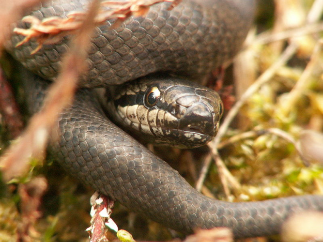
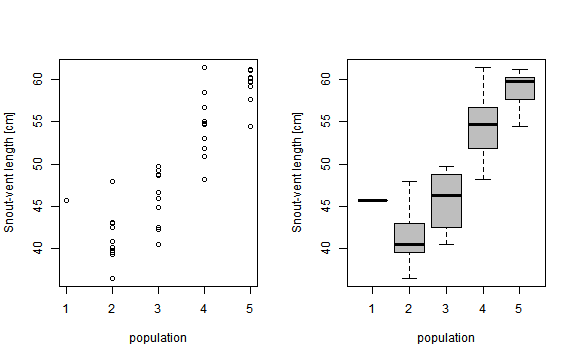
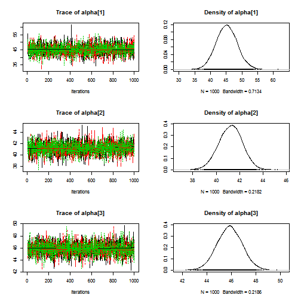
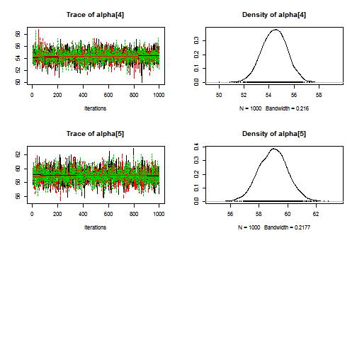
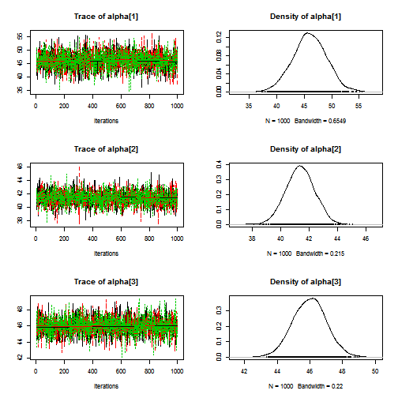
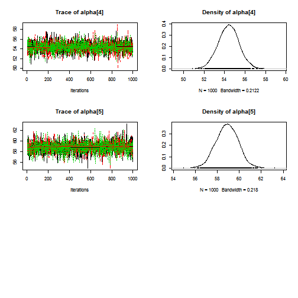
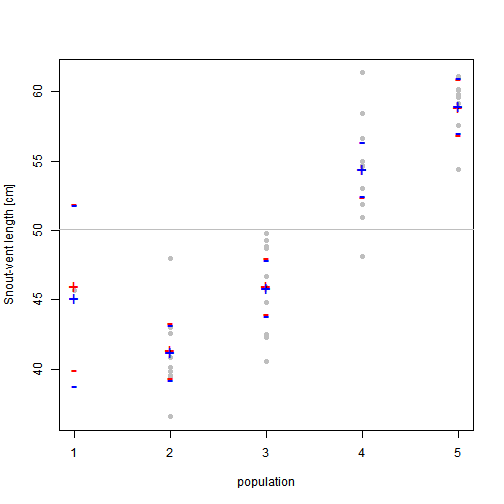

One-way ANOVA
========================================================


The Data
--------

We will use modified data from the example from **Marc Kery's Introduction to WinBUGS for Ecologists**, page 119 (Chapter 9 - ANOVA). The data describe snout-vent lengths in 5 populations of Smooth snake (*Coronella austriaca*) (Uzovka hladka in CZ).




```r
# loading the data from my website
  snakes <- read.csv("http://www.petrkeil.com/wp-content/uploads/2014/02/snakes.csv")

# we will artificially delete 9 data points in the first population
  snakes <- snakes[-(1:9),]

  summary(snakes)
```

```
##    population     snout.vent  
##  Min.   :1.00   Min.   :36.6  
##  1st Qu.:2.00   1st Qu.:43.0  
##  Median :3.00   Median :49.2  
##  Mean   :3.44   Mean   :50.1  
##  3rd Qu.:4.00   3rd Qu.:57.6  
##  Max.   :5.00   Max.   :61.4
```

```r

# plotting the data
  par(mfrow=c(1,2))
  plot(snout.vent ~ population, data=snakes,
       ylab="Snout-vent length [cm]")
  boxplot(snout.vent ~ population, data=snakes,
          ylab="Snout-vent length [cm]",
          xlab="population",
          col="grey")
```

 


********************************************************************************

Fixed-effects ANOVA
-------------------

For a given snake $i$ in population $j$ **the model** can be written as:

$y_{ij} \sim Normal(\alpha_j, \sigma)$

Here is how we prepare the data:

```r
  snake.data <- list(y=snakes$snout.vent,
                     x=snakes$population,
                     N=nrow(snakes), 
                     N.pop=5)
```


Loading the library that communicates with JAGS

```r
library(R2jags)
```


JAGS Model definition:

```r
cat("
  model
  {
    # priors
    sigma ~ dunif(0,100)
    tau <- 1/(sigma*sigma)
    for(j in 1:N.pop)
    {
      alpha[j] ~ dnorm(0, 0.001)
    }
  
    # likelihood
    for(i in 1:N)
    {
      y[i] ~ dnorm(alpha[x[i]], tau)
    }
  }
", file="fixed_anova.txt")
```


And we will fit the model:

```r
model.fit.fix <- jags(data = snake.data, model.file = "fixed_anova.txt", parameters.to.save = c("alpha"), 
    n.chains = 3, n.iter = 2000, n.burnin = 1000, DIC = FALSE)
```

```
## module glm loaded
```

```
## Compiling model graph
##    Resolving undeclared variables
##    Allocating nodes
##    Graph Size: 96
## 
## Initializing model
```

```r

plot(as.mcmc(model.fit.fix))
```

  

```r
model.fit.fix
```

```
## Inference for Bugs model at "fixed_anova.txt", fit using jags,
##  3 chains, each with 2000 iterations (first 1000 discarded)
##  n.sims = 3000 iterations saved
##          mu.vect sd.vect  2.5%   25%   50%   75% 97.5%  Rhat n.eff
## alpha[1]   45.17   3.347 38.80 42.95 45.13 47.42 51.80 1.002  1800
## alpha[2]   41.23   1.022 39.19 40.55 41.25 41.92 43.18 1.001  3000
## alpha[3]   45.85   1.025 43.85 45.17 45.85 46.55 47.89 1.002  1400
## alpha[4]   54.42   1.011 52.45 53.74 54.44 55.11 56.37 1.002  1100
## alpha[5]   59.00   1.019 57.01 58.29 59.00 59.66 61.00 1.001  3000
## 
## For each parameter, n.eff is a crude measure of effective sample size,
## and Rhat is the potential scale reduction factor (at convergence, Rhat=1).
```


********************************************************************************

Random-effects ANOVA
--------------------

For a given snake $i$ in population $j$ **the model** can be written in a similar way as for the fixed-effects ANOVA above:

$y_{ij} \sim Normal(\alpha_j, \sigma)$

But now we will also add a **random effect**:

$\alpha_j \sim Normal(\mu, \sigma)$

In short, a **random effect means that the parameters itself come from (are outcomes of) a given distribution**, here it is the Normal.

The data stay the same as in the fixed-effect example above.

Loading the library that communicates with JAGS

```r
library(R2jags)
```


JAGS Model definition:

```r
cat("
  model
  {
    # priors
    grand.mean ~ dnorm(0, 0.001)
    grand.sigma ~ dunif(0,100)
    grand.tau <- 1/(grand.sigma*grand.sigma)
    group.sigma ~ dunif(0, 100)
    group.tau <- 1/(group.sigma*group.sigma)
  
    for(j in 1:N.pop)
    {
      alpha[j] ~ dnorm(grand.mean, grand.tau)
    }
  
    # likelihood
    for(i in 1:N)
    {
      y[i] ~ dnorm(alpha[x[i]], group.tau)
    }
  }
", file="random_anova.txt")
```


And we will fit the model:

```r
model.fit.rnd <- jags(data = snake.data, model.file = "random_anova.txt", parameters.to.save = c("alpha"), 
    n.chains = 3, n.iter = 2000, n.burnin = 1000, DIC = FALSE)
```

```
## Compiling model graph
##    Resolving undeclared variables
##    Allocating nodes
##    Graph Size: 100
## 
## Initializing model
```

```r

plot(as.mcmc(model.fit.rnd))
```

  

```r
model.fit.rnd
```

```
## Inference for Bugs model at "random_anova.txt", fit using jags,
##  3 chains, each with 2000 iterations (first 1000 discarded)
##  n.sims = 3000 iterations saved
##          mu.vect sd.vect  2.5%   25%   50%   75% 97.5%  Rhat n.eff
## alpha[1]   46.02   3.064 39.95 44.00 46.02 48.11 51.94 1.001  3000
## alpha[2]   41.37   1.031 39.37 40.70 41.37 42.05 43.31 1.002  1900
## alpha[3]   45.98   1.033 43.99 45.28 46.00 46.66 47.99 1.001  3000
## alpha[4]   54.40   1.015 52.42 53.73 54.40 55.06 56.40 1.001  3000
## alpha[5]   58.87   1.027 56.87 58.20 58.88 59.56 60.91 1.004   640
## 
## For each parameter, n.eff is a crude measure of effective sample size,
## and Rhat is the potential scale reduction factor (at convergence, Rhat=1).
```


********************************************************************************
Plotting the posteriors from both models
----------------------------------------

Let's extract the medians posterior distributions of the expected values of $\alpha_j$ and their 95% credible intervals:

```r
rnd.alphas <- model.fit.rnd$BUGSoutput$summary
fix.alphas <- model.fit.fix$BUGSoutput$summary

plot(snout.vent ~ population, data = snakes, ylab = "Snout-vent length [cm]", 
    col = "grey", pch = 19)
points(rnd.alphas[, "2.5%"], col = "red", pch = "-", cex = 1.5)
points(fix.alphas[, "2.5%"], col = "blue", pch = "-", cex = 1.5)
points(rnd.alphas[, "97.5%"], col = "red", pch = "-", cex = 1.5)
points(fix.alphas[, "97.5%"], col = "blue", pch = "-", cex = 1.5)
points(rnd.alphas[, "50%"], col = "red", pch = "+", cex = 1.5)
points(fix.alphas[, "50%"], col = "blue", pch = "+", cex = 1.5)

abline(h = mean(snakes$snout.vent), col = "grey")
```

 


Note the **shrinkage** effect!

Also, how would you plot the ```grand.mean``` estimated in the random effects model?
How would you extract the between- and within- group variances?


