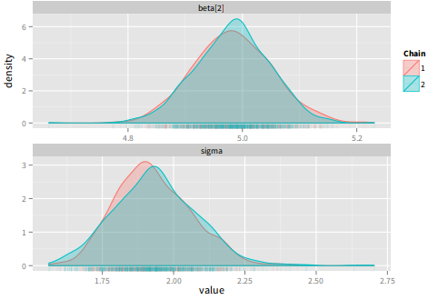
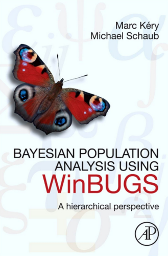
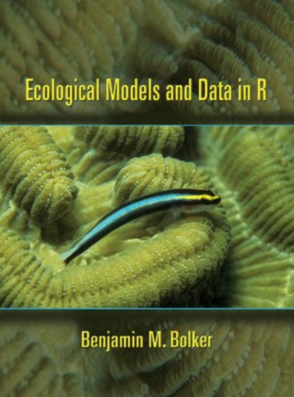
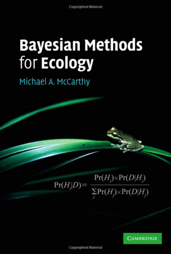
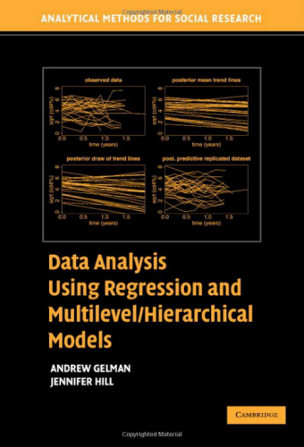
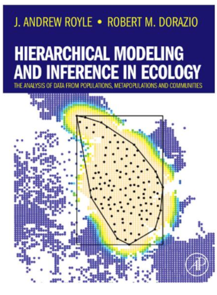
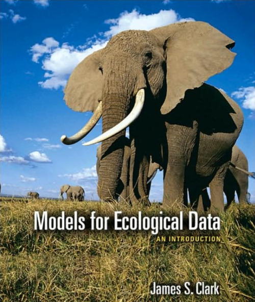

Bayesian resources
========================================================
author: Petr Keil
date: February 2014

Software
========================================================
**OpenBUGS** [www.openbugs.net](http://openbugs.net/w/FrontPage)
- Successor of (now discontinued) WinBUGS.
- The software that made Bayesian analysis popular.
- Has a GUI, but can also be commanded from **R**.
- Great set of example models.
- Difficult to debug, somewhat unpredictable.

**R packages for OpenBUGS**
- ```BRugs``` - gives full control over OpenBUGS
- ```R2OpenBUGS``` - simpler and more user-friendly

Software
========================================================
**JAGS** [mcmc-jags.sourceforge.net/](http://mcmc-jags.sourceforge.net/)
- Just Another Gibbs Sampler.
- Reliable, cross-platform.
- Uses the BUGS language (almost identical to OpenBUGS).
- Can be commanded from within **R**.

**R packages for JAGS**
- ```rjags ``` - gives full control over JAGS
- ```R2jags``` - simpler and more user-friendly

Software
========================================================
**STAN** - [mc-stan.org](mc-stan.org)
- The newest and fastest one.
- Can be commanded from **R**, **Python** or shell.
- Does not use the BUGS language, but the code is similar.
- The future of MCMC.

**R packages for STAN**
- ```RStan```

Software
========================================================
**Other useful R packages** - [see the CTAN taskview](http://cran.r-project.org/web/views/Bayesian.html)

- ```coda``` handles and summarizes MCMC output.
- ```MCMCglmm``` simple Bayesian GLM fitting. 
- ```spBayes``` and ```geoRglm``` for spatially explicit modelling.
- ```ggmcmc``` pretty output visualization in ```ggplot2``` style.


Books
========================================================



Books
========================================================



Books
========================================================



Books
========================================================



Books
========================================================


On-line resources
========================================================
- [The CTAN taskview](http://cran.r-project.org/web/views/Bayesian.html) - essential R packages.
- [Andrew Gelman](http://andrewgelman.com/)'s blog.
- [J.M. White's tutorial](http://www.johnmyleswhite.com/notebook/2010/08/20/using-jags-in-r-with-the-rjags-package/) on setting up R & JAGS.
- N.T. Hobbs' [An ecological modeler's primer on JAGS](http://hydrodictyon.eeb.uconn.edu/people/cmerow/home/teaching_files/Short_Course/A_Primer_on_JAGS_for_Ecological_Modelers_III1.pdf)
- Ben Bolker's [Ecological Models and Data in R](http://ms.mcmaster.ca/~bolker/emdbook/) - free manuscript.
- User manuals for [OpenBUGS](http://www.openbugs.net/w/Documentation), [JAGS](http://people.math.aau.dk/~kkb/Undervisning/Bayes13/sorenh/docs/jags_user_manual.pdf) and [STAN](http://mc-stan.org/manual.html)
- [R-bloggers](http://www.r-bloggers.com/) and [Cross Validated](http://stats.stackexchange.com/).
