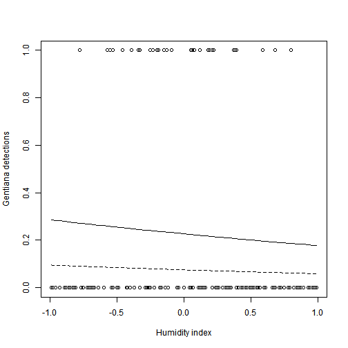
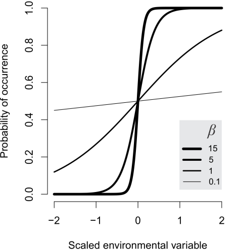
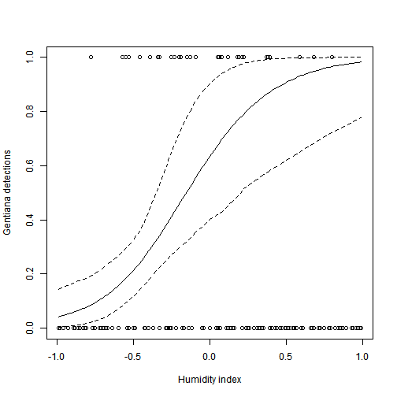
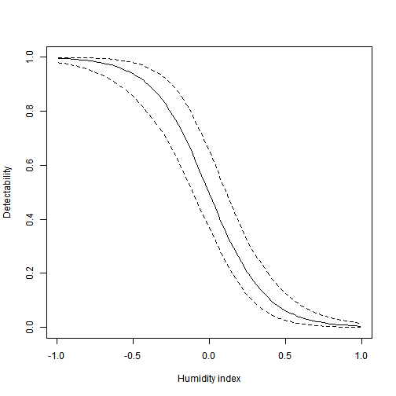

Site occupancy model with imperfect detectability
========================================================


********************************************************************************

The Data
--------
We will work with **Marc Kery's data from chapter 20** of his Introduction to WinBUGS for ecologists.
The data describe detections of *Gentianella germanica* at 150 sites, each visited 3 times. We wish to estimate the relationship between P of occurence, and a humidity index. However, we also know that the detectability of the species depends on humidity itself.


Loading the data from the web

```r
gentiana <- read.csv("http://www.petrkeil.com/wp-content/uploads/2014/02/gentiana.csv")
gentiana <- gentiana[, -1]
```


The "naive" analysis by GLM:

```r
  # fitting classical LOGISTIC REGRESSION of presence-absence data
  naive.m1 <- glm(pres.abs~humidity, data=gentiana, family="binomial")
  
  # or the response can be number of successes out of 3 visits
  succ.fail <- cbind(gentiana$pres.abs, 3-gentiana$pres.abs)
  naive.m2 <- glm(succ.fail~humidity, data=gentiana, family="binomial")
  
  # plotting the data and the predictions
  plot(gentiana$humidity, gentiana$pres.abs,
       xlab="Humidity index", ylab="Gentiana detections")
  lines(gentiana$humidity, predict(naive.m1, type="response"))
  lines(gentiana$humidity, predict(naive.m2, type="response"), lty=2)
```

 


********************************************************************************
Bayesian model with imperfect detection
---------------------------------------

**Model definition**

$z_i \sim Bernoulli(\psi)$

$y_{ij} \sim (z_i \times p_{ij})$

Where $z_i$ is the unobserved but true occurrence, $\psi$ is probability of occurrence, $y_{ij}$ is the detection or non-detection (the actual data) at site $i$ during visit $j$, and $p_{ij}$ is the detection probability of the species.

We also know that

$p_{ij}=f(environment_{ij})$

and that

$\psi=f(environment_i)$

********************************************************************************

Let's prepare the data for JAGS:

```r
# just make the 2D array as simple as possible
y <- as.matrix(gentiana[, 2:4])
colnames(y) <- NULL

gentiana.data <- list(N.sites = nrow(y), N.visit = ncol(y), humidity = gentiana$humidity, 
    y = y)
```


Our favourite library:

```r
library(R2jags)
```


********************************************************************************

Here is a little guide for specifying **priors for logistic regression**:



********************************************************************************

The model:

```r
  cat("
    model
    {
    # priors
      alpha.occ ~ dnorm(0, 0.01)
      beta.occ ~ dnorm(0, 0.01)
      alpha.det ~ dnorm(0, 0.01)
      beta.det ~ dnorm(0, 0.01)
      
    # likelihood 
      for(i in 1:N.sites)
      {
        z[i] ~ dbern(psi[i]) # true occupancy at site i
        logit(psi[i]) <- alpha.occ + beta.occ*humidity[i] 
     
        for(j in 1:N.visit)
        {
           logit(p[i,j]) <- alpha.det + beta.det*humidity[i] # detection probability
           eff.p[i,j] <- z[i] * p[i, j] # p of observing the present individual
           y[i,j] ~ dbern(eff.p[i,j]) # detection/non-detection at [i,j]
        }  
      }
    }
  ", file="gentiana.txt")
```

  
Initial values are really important for models with **latent variables**! You have to specify them, otherwise it won't work.

```r
  zst <- apply(X=y, MARGIN=1, FUN=max)
  
  inits <- function(){list(z=zst, alpha.occ=rnorm(1),
                beta.occ=rnorm(1),
                alpha.det=rnorm(1),
                beta.det=rnorm(1))}
```


Now we can run the model:

```r
  model.fit <- jags(data=gentiana.data, 
                 model.file="gentiana.txt",
                 parameters.to.save=c("psi"),
                 n.chains=1,
                 n.iter=2000,
                 n.burnin=1000,
                 inits=inits, 
                 DIC=FALSE)
```

```
## module glm loaded
```

```
## Compiling model graph
##    Resolving undeclared variables
##    Allocating nodes
##    Graph Size: 1610
## 
## Initializing model
```


```r
plot(gentiana$humidity, gentiana$pres.abs, xlab = "Humidity index", ylab = "Gentiana detections")
lines(gentiana$humidity, model.fit$BUGSoutput$summary[, "50%"])
lines(gentiana$humidity, model.fit$BUGSoutput$summary[, "2.5%"], lty = 2)
lines(gentiana$humidity, model.fit$BUGSoutput$summary[, "97.5%"], lty = 2)
```

 


And let's pull out the **detectability**:

Now we can run the model:

```r
  model.fit <- jags(data=gentiana.data, 
                 model.file="gentiana.txt",
                 parameters.to.save=c("p"),
                 n.chains=1,
                 n.iter=2000,
                 n.burnin=1000,
                 inits=inits, 
                 DIC=FALSE)
```

```
## Compiling model graph
##    Resolving undeclared variables
##    Allocating nodes
##    Graph Size: 1610
## 
## Initializing model
```

```r

plot(gentiana$humidity, gentiana$pres.abs,
       xlab="Humidity index", ylab="Detectability", type="n")
lines(gentiana$humidity, model.fit$BUGSoutput$summary[1:150,'50%'])
lines(gentiana$humidity, model.fit$BUGSoutput$summary[1:150,'2.5%'], lty=2)
lines(gentiana$humidity, model.fit$BUGSoutput$summary[1:150,'97.5%'], lty=2)
```

 


